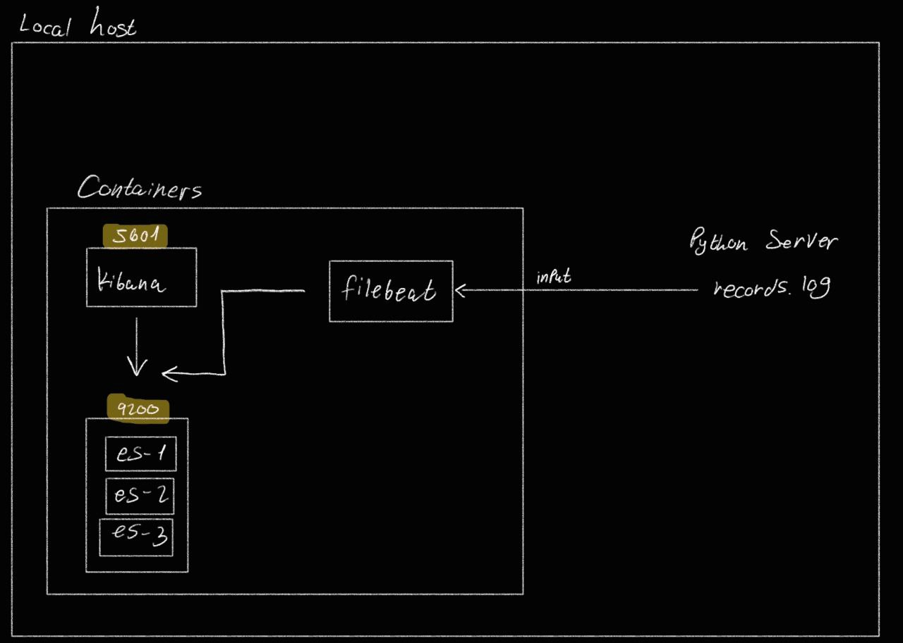

# ELK Stack local lab


---


### Note for mac users:

* Update set ```useGrpcfuse": false``` inside  docker configuration file : ```vi  ~/Library/Group\ Containers/group.com.docker/settings.json```


---


The sample ```docker-compose.yml``` consists of five services: setup, es01, es02, es03, kibana and filebeat. 


Generating a Certificate for Filebeat
The setup service in ```docker-compose.yml``` has a script that generates the certificates used by all the Elastic stack services defined there. 

It creates a file at ```config/certs/instances.yml ```specifying what certificates are needed,

and passes that to the ```bin/elasticsearch-certutil``` command to create them. We can follow the same pattern as the other services in ```instances.yml``` to create a certificate for Filebeat:
```
"  - name: es03\n"\
"    dns:\n"\
"      - es03\n"\
"      - localhost\n"\
"    ip:\n"\
"      - 127.0.0.1\n"\
"  - name: filebeat\n"\
"    dns:\n"\
"      - es03\n"\
"      - localhost\n"\
"    ip:\n"\
"      - 127.0.0.1\n"\
> config/certs/instances.yml;
```


Filebeat logs : ```Connection to backoff(elasticsearch(https://es01:9200)) established"```


check whether an index has actually been created : ``` GET _cat/indices shows that we have a Filebeat index. ```

---


## Qurry elastic-rest-api outside of the docker network, etc your host:
### Secure request : 
copy ca cet from one of the nodes

- ```  docker cp  stage-1-es03-1:/usr/share/elasticsearch/config/certs/ca/ca.crt .```


# Test https request : 
```json
$ curl --cacert ca.crt -X GET  https://localhost:9200/ | jq
  % Total    % Received % Xferd  Average Speed   Time    Time     Time  Current
                                 Dload  Upload   Total   Spent    Left  Speed
100   459  100   459    0     0  11158      0 --:--:-- --:--:-- --:--:-- 38250
{
  "error": {
    "root_cause": [
      {
        "type": "security_exception",
        "reason": "missing authentication credentials for REST request [/]",
        "header": {
          "WWW-Authenticate": [
            "Basic realm=\"security\" charset=\"UTF-8\"",
            "Bearer realm=\"security\"",
            "ApiKey"
          ]
        }
      }
    ],
    "type": "security_exception",
    "reason": "missing authentication credentials for REST request [/]",
    "header": {
      "WWW-Authenticate": [
        "Basic realm=\"security\" charset=\"UTF-8\"",
        "Bearer realm=\"security\"",
        "ApiKey"
      ]
    }
  },
  "status": 401
}
```

### Authentication

```json
$ curl -u elastic:elastic --cacert ca.crt -X GET  https://localhost:9200/ | jq
  % Total    % Received % Xferd  Average Speed   Time    Time     Time  Current
                                 Dload  Upload   Total   Spent    Left  Speed
100   531  100   531    0     0   4577      0 --:--:-- --:--:-- --:--:--  4916
{
  "name": "es01",
  "cluster_name": "docker-cluster",
  "cluster_uuid": "w0ZE-x5QQm-hHqqPyb4LJA",
  "version": {
    "number": "8.4.3",
    "build_flavor": "default",
    "build_type": "docker",
    "build_hash": "42f05b9372a9a4a470db3b52817899b99a76ee73",
    "build_date": "2022-10-04T07:17:24.662462378Z",
    "build_snapshot": false,
    "lucene_version": "9.3.0",
    "minimum_wire_compatibility_version": "7.17.0",
    "minimum_index_compatibility_version": "7.0.0"
  },
  "tagline": "You Know, for Search"
}

```


### Query Index using elastic rest api  :
```json
$ curl -H "Content-Type:application/json" -u elastic:elastic --cacert ca.crt -X GET  https://localhost:9200/products/_search -d '{ "query": { "match_all": {} } }'  | jq
  % Total    % Received % Xferd  Average Speed   Time    Time     Time  Current
                                 Dload  Upload   Total   Spent    Left  Speed
100   409  100   377  100    32  24646   2092 --:--:-- --:--:-- --:--:-- 51125
{
  "error": {
    "root_cause": [
      {
        "type": "index_not_found_exception",
        "reason": "no such index [products]",
        "resource.type": "index_or_alias",
        "resource.id": "products",
        "index_uuid": "_na_",
        "index": "products"
      }
    ],
    "type": "index_not_found_exception",
    "reason": "no such index [products]",
    "resource.type": "index_or_alias",
    "resource.id": "products",
    "index_uuid": "_na_",
    "index": "products"
  },
  "status": 404
}
```
ass expected no such index [products] 


## Interactig Elastic using Kibana/DevTolls/Console

```
GET  /_cluster/health
get /_cat/nodes/?v
put /pages
get /_cluster/health
get /_cat/indices?v

get /_cat/shards?v
```

### Create indices with sharsd :


Request:

```
put /pages
{
  "settings":{
    "number_of_shards": 2,
    "number_of_replicas": 2
  }
}

```
Response 
``` 
{
  "acknowledged": true,
  "shards_acknowledged": true,
  "index": "pages"
}

```

### Creating Document : 
```
post /products/_doc
{
  "name": "Coffe Maker",
  "price": 49,
  "in_stock": 4
} 
```


``` console
{
  "_index": "products",
  "_id": "s4dQ2YQBdupJyOWaGEPV",
  "_version": 1,
  "result": "created",
  "_shards": {
    "total": 2,
    "successful": 1,
    "failed": 0
  },
  "_seq_no": 0,
  "_primary_term": 1
}
```

Lets retrive the document with curl get request : 
```json
 $ curl -H "Content-Type:application/json" -u elastic:elastic --cacert ca.crt -X GET  https://localhost:9200/products/_doc/s4dQ2YQBdupJyOWaGEPV  | jq
  % Total    % Received % Xferd  Average Speed   Time    Time     Time  Current
                                 Dload  Upload   Total   Spent    Left  Speed
100   177  100   177    0     0   5837      0 --:--:-- --:--:-- --:--:--  7695
{
  "_index": "products",
  "_id": "s4dQ2YQBdupJyOWaGEPV",
  "_version": 1,
  "_seq_no": 0,
  "_primary_term": 1,
  "found": true,
  "_source": {
    "name": "Coffe Maker",
    "price": 49,
    "in_stock": 4
  }
}
```